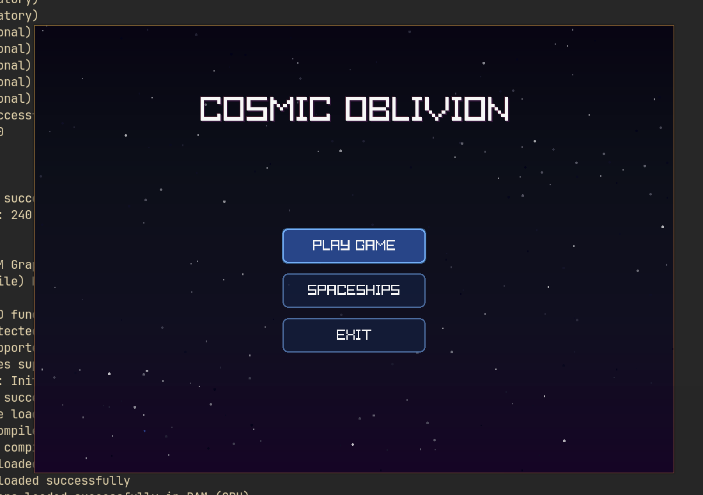
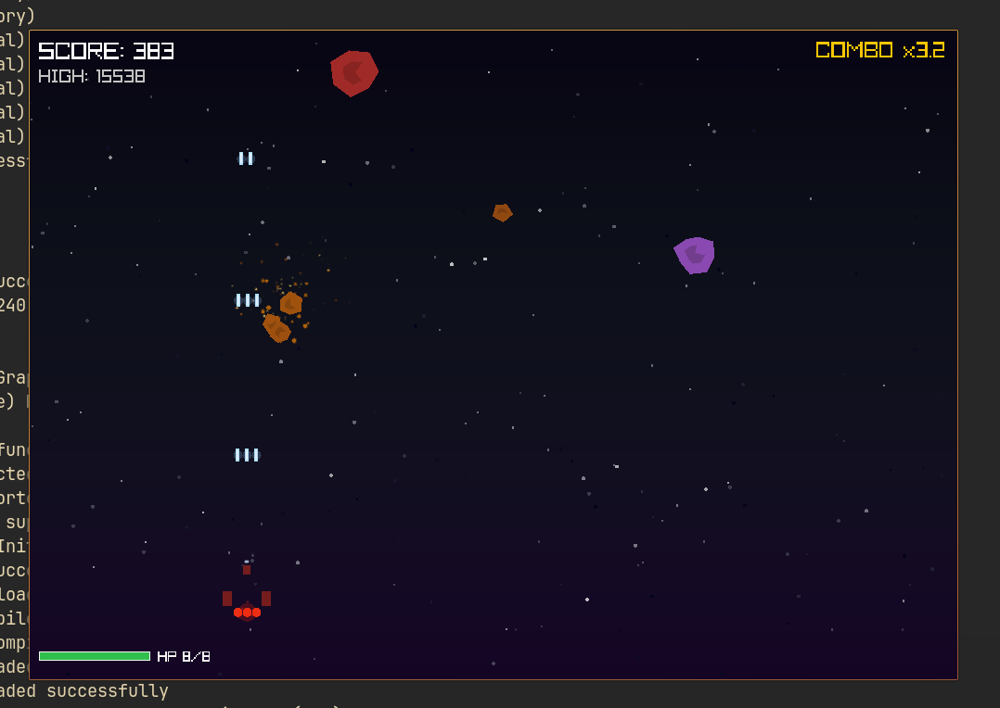

# COSMIC OBLIVION

> A polished arcade-style space shooter built in pure C with raylib.


------------------------------------------------------------------------

## Screenshots

|Main Menu | Gameplay |
| :--- | :--- |
| | |

------------------------------------------------------------------------

## About The Game

**Cosmic Oblivion** is a fast-paced arcade-style space shooter built
entirely in C using the raylib graphics library.

**The game features:** 
- A state-driven UI system
- Three selectable spaceships 
- Enemy ships with unique behaviors
- Procedural meteor generation 
- Particle-based visual effects 
- Health pickup system (drops from meteors)
- Shield pickup system
- Floating text feedback
- Score & persistent highscore system 
- Audio system (BGM + sound effects)
- Smooth animations and screen effects

**Gameplay loop:**

> Spawn → Dodge → Shoot → Survive → Score → Game Over → Retry

------------------------------------------------------------------------

## Features

### Gameplay

-   60 FPS smooth gameplay
-   Delta-time based movement
-   Acceleration & velocity-based controls
-   HP system
-   Combo multiplier
-   Progressive difficulty scaling

### Enemy Ships

-   **Scout** --- Fast, weak, rapid-fire
-   **Fighter** --- Balanced stats
-   **Bomber** --- Slow but heavy damage

**Each enemy includes:** 
- Unique visual design 
- AI movement patterns 
- Shooting behavior
- Collision with player

### Audio System

-   Background music (menu, gameplay, game over)
-   Player shooting sounds
-   Meteor explosion sounds (randomized)
-   Engine sound effects
-   Damage taken sound
-   Health pickup sound
-   Shield pickup sound
-   Global audio toggle

### Shield Pickups

-   Dropped from destroyed enemies
-   Provides temporary shield protection
-   Visual shield bubble effect

### Spaceships

-   **Interceptor** --- Fast, lightweight, rapid-fire
-   **Destroyer** --- Balanced stats
-   **Titan** --- Slow but heavy damage

**Each ship includes:** 
- Unique visual design 
- Engine glow effects 
- Custom fire rate 
- Distinct stats

### Meteors

-   Small, Medium, Large types
-   Procedural irregular shapes
-   Rotation while falling
-   Break into smaller fragments
-   Difficulty scales over time

### Visual Effects

-   Custom particle system
-   Engine trails
-   Explosion bursts
-   Glow simulation
-   Screen shake effects
-   Animated parallax starfield background
-   Health pickup drops from destroyed meteors
-   Floating "+HP" feedback text
-   Shield bubble visualization

### UI System

-   Animated main menu
-   Mouse & keyboard navigation
-   Ship selection screen
-   Pause screen
-   Game Over screen
-   Smooth state transitions

------------------------------------------------------------------------

## Project Structure

```
cosmic-oblivion/
├── src/
│   ├── main.c         # Entry point, game loop
│   ├── game.c         # Core game logic
│   ├── helpers.c      # Utility functions
│   ├── stars.c        # Background starfield
│   ├── particles.c    # Particle effects
│   ├── healthstar.c   # Health pickup system
│   ├── shieldpickup.c # Shield pickup system
│   ├── floatingtext.c # Floating text feedback
│   ├── button.c       # UI buttons
│   ├── ship.c         # Ship rendering
│   ├── enemy.c        # Enemy ship system
│   ├── meteor.c       # Meteor system
│   └── ui.c           # Screen functions
├── include/
│   ├── constants.h    # Constants, enums, types
│   ├── game.h         # Game logic declarations
│   ├── helpers.h      # Helper function declarations
│   ├── stars.h        # Starfield declarations
│   ├── particles.h    # Particle declarations
│   ├── healthstar.h   # Health star declarations
│   ├── shieldpickup.h # Shield pickup declarations
│   ├── floatingtext.h # Floating text declarations
│   ├── button.h       # Button declarations
│   ├── ship.h         # Ship declarations
│   ├── enemy.h        # Enemy declarations
│   ├── meteor.h       # Meteor declarations
│   └── ui.h           # UI declarations
├── audio/             # Sound effects and BGM
│   ├── bg/            # Background music
│   ├── explosion/     # Explosion sounds
│   ├── firing_sound/  # Player shooting sounds
│   ├── damage/        # Damage sounds
│   ├── health_pickup.wav
│   ├── shield/        # Shield sounds
│   └── ship_engine/   # Engine sounds
├── screenshots/      # Game screenshots
├── Makefile          # Build automation
├── AGENTS.md         # Developer documentation
└── README.md         # This file
```

------------------------------------------------------------------------

## Requirements

-   Linux (X11)
-   GCC
-   raylib (latest stable)

Compatible with Windows and macOS if raylib is installed correctly.

------------------------------------------------------------------------

## Installing raylib

### Arch Linux

    sudo pacman -S raylib

### Ubuntu / Debian (Build from source)

    git clone https://github.com/raysan5/raylib.git
    cd raylib
    mkdir build && cd build
    cmake ..
    make
    sudo make install

### Windows & macOS
Follow the official [raylib installation guide](https://github.com/raysan5/raylib?tab=readme-ov-file#build-and-installation) for detailed setup instructions on these platforms.

------------------------------------------------------------------------

## Compile & Run

### Using Makefile (recommended)
```bash
make           # Compile game
make run       # Compile and run
make debug     # Debug build with -g -O0
make release   # Release build with -O2
make lint      # Run cppcheck static analysis
make analyze   # Run gcc -fanalyzer
make clean     # Clean build artifacts
```

### Manual Compile
```bash
gcc src/*.c -I. -lraylib -lm -lpthread -ldl -lrt -lX11 -o cosmic
./cosmic
```

**Flags Summary:**
* `-lraylib`: Link the raylib graphics library.
* `-lm`: Link the math library.
* `-lpthread`: Enable POSIX threads support.
* `-ldl`: Dynamic linking loader library.
* `-lrt`: Realtime extensions library.
* `-lX11`: X Window System support.

------------------------------------------------------------------------

## Controls

| Action | Key |
| :--- | :--- |
| **Move** | WASD / Arrow Keys |
| **Shoot** | Space |
| **Pause** | ESC |
| **Select** | Enter |

> **Tip:** Large and medium meteors have a chance to drop health pickups. Collect them to restore HP!

------------------------------------------------------------------------

## Highscore System

-   Stored in `highscore.txt`
-   Auto-created if missing
-   Updated when a new record is achieved

------------------------------------------------------------------------

## Development Philosophy

-   Built in pure C (C99 compatible)
-   No external game engine
-   Minimal dependencies (raylib + standard C)
-   Modular architecture (14 source files)
-   Clean state-based architecture
-   Audio integration for immersive gameplay

------------------------------------------------------------------------

## License

This project is open-source under the **MIT License**.
